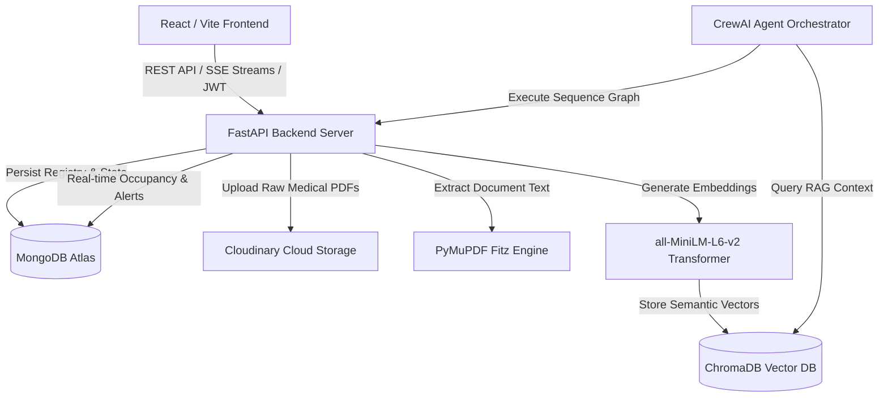

# 🏥 Aegis: AI Hospital Operations & Emergency Coordination Platform

[](https://fastapi.tiangolo.com/)
[](https://react.dev/)
[](https://vitejs.dev/)
[](https://crewai.com/)
[](https://www.trychroma.com/)
[](https://www.mongodb.com/)

**Aegis** is a production-grade, full-stack AI platform designed to automate hospital emergency triage, intelligent bed management, patient registry coordination, and medical report parsing. Built with **FastAPI**, **React (Vite)**, **CrewAI**, and **ChromaDB**, Aegis deploys multi-agent collaborative workflows and RAG (Retrieval-Augmented Generation) pipelines to assist healthcare professionals in real-time decision-making.

---

## ✨ Key Features

* 🚨 **Real-Time AI Triage & Severity Classification**: Streams live clinical reasoning via Server-Sent Events (SSE). Automatically evaluates patient symptoms, vitals, and notes to assign severity levels (`CRITICAL`, `HIGH`, `MEDIUM`, `LOW`).
* 🛏️ **Intelligent Bed Allocation Engine**: Real-time ward matching algorithm that assigns patients to the appropriate ward (**ICU**, **Emergency Ward**, or **General Ward**) based on severity, specialty requirements, and real-time occupancy tracking.
* 📄 **Medical PDF Report Parsing & RAG Search**: Upload laboratory reports and clinical notes directly to cloud storage (**Cloudinary**). Extracts text using **PyMuPDF**, generates embeddings with `all-MiniLM-L6-v2`, and stores semantic vectors in **ChromaDB** for instant context retrieval.
* 🤖 **Interactive Multi-Agent Assistant & Handoff Summaries**: Powered by **Groq Llama 3** and **CrewAI**, medical staff can chat with specialized AI agents (Triage, Priority, Bed Allocation, Doctor Summary, and Risk Review) to generate shift handoff checklists and risk assessments.
* 📊 **Operations Control Center**: A dynamic, glassmorphic UI dashboard displaying live emergency queues, occupancy percentages, critical case counters, and system health alerts.

---

## 🏗️ Technical Architecture



---

## 📂 Project Structure

```
hospital-agent/
├── backend/
│   ├── app/
│   │   ├── agents/          # Specialized AI Agents (Triage, Priority, Bed, Doctor, Risk)
│   │   ├── crew/            # CrewAI Sequential Workflow Orchestration
│   │   ├── database/        # MongoDB Motor & ChromaDB Connectors
│   │   ├── middleware/      # JWT Authentication & Security Guard
│   │   ├── models/          # Pydantic Schemas (User, Patient, Bed, Report, Analysis)
│   │   ├── routes/          # API Routers (/auth, /patients, /beds, /reports, /ai, /dashboard)
│   │   ├── services/        # Core Services (RAG, PDF Extraction, Cloudinary Storage)
│   │   ├── tasks/           # CrewAI Task Definitions & Prompts
│   │   └── main.py          # FastAPI Application Bootloader & CORS Setup
│   ├── render.yaml          # Render Cloud Infrastructure Blueprint (IaC)
│   ├── requirements.txt     # Python Dependencies
│   ├── seed_data.py         # Database Seeder (55 Beds & Default Admin User)
│   └── .env.example         # Environment Variables Template
├── frontend/
│   ├── src/
│   │   ├── components/      # Reusable UI Widgets (Beds, Patients, Reports, Emergency)
│   │   ├── context/         # AuthContext & State Management
│   │   ├── pages/           # Application Views (Dashboard, Triage Queue, Bed Management)
│   │   ├── services/        # Axios API Interceptors & Endpoint Mappings
│   │   └── utils/           # Styling Constants & Helper Utilities
│   ├── vercel.json          # Vercel SPA Routing Configuration
│   ├── tailwind.config.js   # TailwindCSS Theme & Custom Extensions
│   ├── vite.config.js       # Vite Bundler & Local API Proxy
│   └── package.json         # Node Dependencies & Scripts
└── README.md                # Documentation
```

---

## 🚀 Local Development Setup

### Prerequisites
* **Node.js** (v18+) & **npm**
* **Python** (v3.10 or v3.11 recommended)
* **MongoDB Atlas** Account (Free Tier Cluster)
* **Groq API Key** (for LLM inference)
* **Cloudinary** Account (for PDF report cloud storage)

### 1. Backend Setup
Navigate to the `backend` folder, create a virtual environment, and install dependencies:
```bash
cd backend
python -m venv venv

# Windows
.\venv\Scripts\activate
# macOS/Linux
source venv/bin/activate

pip install -r requirements.txt
```

Create your environment file:
```bash
cp .env.example .env
```
Edit `.env` and fill in your connection strings:
* `MONGODB_URI`: Your MongoDB Atlas connection URI.
* `GROQ_API_KEY`: Groq developer API key (`gsk_...`).
* `CLOUDINARY_CLOUD_NAME`, `CLOUDINARY_API_KEY`, `CLOUDINARY_API_SECRET`: Cloudinary API credentials.
* `JWT_SECRET`: A secure random secret for signing authentication tokens.

Seed the initial database (creates 55 hospital beds and default admin):
```bash
python seed_data.py
```
> **Default Admin Login:** `admin@hospital.com` / `admin123`

Start the backend server:
```bash
uvicorn app.main:app --reload --port 8000
```
*API documentation (Swagger UI) is available at: `http://localhost:8000/docs`*

---

### 2. Frontend Setup
Open a new terminal, navigate to the `frontend` folder, and install packages:
```bash
cd frontend
npm install
```

Create a local environment file `.env`:
```env
VITE_API_BASE_URL=http://localhost:8000/api
```

Start the Vite development server:
```bash
npm run dev
```
*Open your browser and navigate to: `http://localhost:5173`*

---

## 🌐 Cloud Deployment Guide (Vercel + Render)

Aegis is optimized for cloud deployment using **Vercel** for the React frontend and **Render** for the Python FastAPI backend.

### 1. Deploying the Backend on Render
1. Push your repository to GitHub or GitLab.
2. Log into [Render](https://dashboard.render.com/) and click **New +** ➔ **Blueprint** (or **Web Service**).
3. Connect this repository. Render will automatically detect `backend/render.yaml`.
   * **Note on Memory**: Because AI embedding transformers (`sentence-transformers`) load into RAM, we strongly recommend selecting at least the **Starter Plan ($7/mo)** (2GB+ RAM) to avoid Free Tier Out-Of-Memory (OOM) errors.
4. In your Render Dashboard Environment Variables settings, configure:
   * `MONGODB_URI`
   * `GROQ_API_KEY`
   * `CLOUDINARY_CLOUD_NAME`, `CLOUDINARY_API_KEY`, `CLOUDINARY_API_SECRET`
5. Click **Deploy**. Copy your live backend service URL (e.g., `https://hospital-agent-backend.onrender.com`).

### 2. Deploying the Frontend on Vercel
1. Log into [Vercel](https://vercel.com/) and click **Add New** ➔ **Project**.
2. Import your Git repository.
3. In Project Settings:
   * **Root Directory**: Select `frontend`.
   * **Framework Preset**: Vite / React.
4. Add the following Environment Variable:
   * **Key**: `VITE_API_BASE_URL`
   * **Value**: `https://hospital-agent-backend.onrender.com/api` *(Your Render backend URL)*
5. Click **Deploy**. Note: `frontend/vercel.json` is pre-configured to handle SPA routing seamlessly!

---

## 🤖 CrewAI Specialized Agents

| Agent Name | Primary Role | Tools & Capabilities |
| :--- | :--- | :--- |
| **Emergency Triage Agent** | Analyzes patient admission notes & vitals | Queries ChromaDB for historical symptoms; outputs clinical severity. |
| **Priority Classifier** | Organizes emergency queue positioning | Computes wait time vs. risk ratio to establish triage priority. |
| **Bed Allocation Engine** | Recommends optimal ward assignments | Queries available ICU, EMR, and GEN beds; prevents capacity conflicts. |
| **Doctor Summary Agent** | Prepares structured clinical handoffs | Synthesizes lab report text and vitals into actionable checklists. |
| **Risk Review Auditor** | Monitors hospital-wide risk & alerts | Evaluates ward occupancy thresholds and flags bottlenecks. |

---

## 📜 License & Acknowledgements

Built with passion for advanced healthcare automation. Powered by **FastAPI**, **React**, **CrewAI**, **Groq Llama 3**, **ChromaDB**, and **MongoDB Atlas**.
